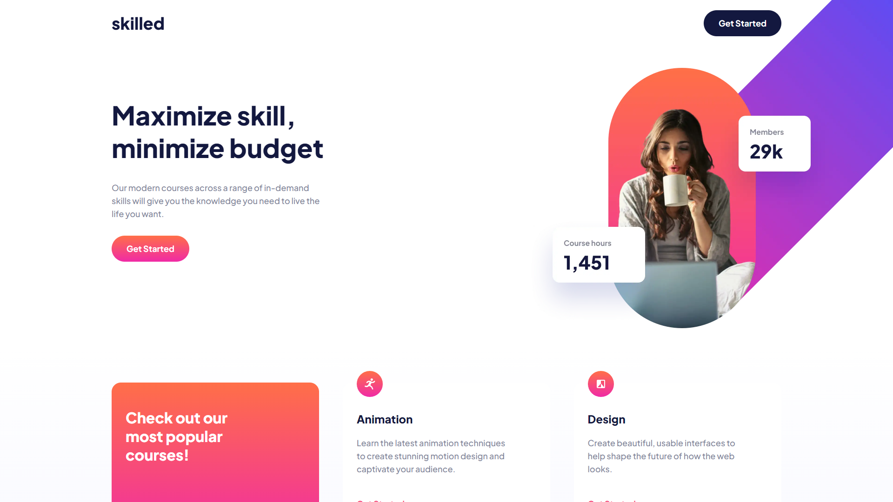

# Frontend Mentor - Skilled e-learning landing page solution

This is a solution to the [Skilled e-learning landing page challenge on Frontend Mentor](https://www.frontendmentor.io/challenges/skilled-elearning-landing-page-S1ObDrZ8q). Frontend Mentor challenges help you improve your coding skills by building realistic projects.

## Table of contents

- [Overview](#overview)
  - [The challenge](#the-challenge)
  - [Screenshot](#screenshot)
  - [Links](#links)
- [My process](#my-process)
  - [Built with](#built-with)
  - [What I learned](#what-i-learned)
  - [Continued development](#continued-development)
- [Author](#author)

## Overview

### The challenge

Users should be able to:

- View the optimal layout depending on their device's screen size
- See active states for interactive elements

### Screenshot



### Links

- Solution URL: [github repo](https://github.com/ZZ83/elearning-landing-page)
- Live Site URL: [Live Website](https://zz83.github.io/elearning-landing-page/)

## My process

### Built with

- HTML
- CSS
- Flexbox
- Mobile-first workflow

### What I learned

I was able to get a better understanding of the CSS `position` property, especially when it comes to working with the `relative` and `absolute` values.

```html
<div class="parent">
  <div class="child"></div>
</div>
```
```css
.parent {
  position: relative;
}

.child {
  position: absolute;
}
```

When the parent element is set to relative positioning, using position absolute on the child element will position the element relative to the parent element and not the html element.

### Continued development

I would like to learn more about the inset property.

## Author

- Frontend Mentor - [ZZ83](https://www.frontendmentor.io/profile/ZZ83)
